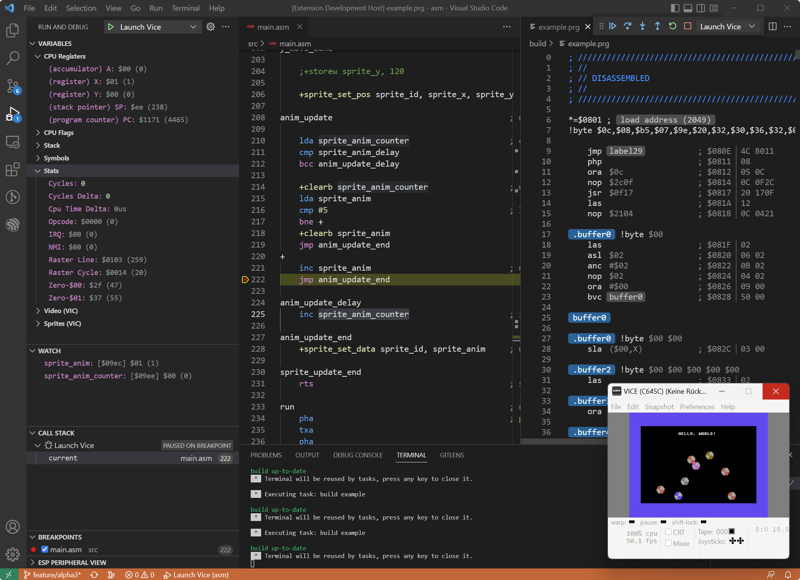

[](https://marketplace.visualstudio.com/items?itemName=rosc.vs64) [](https://marketplace.visualstudio.com/items?itemName=rosc.vs64) [](https://dev.azure.com/ms-azuretools/AzCode/_build/latest?definitionId=22&branchName=main)

# VS64 - The C64 Development Environment

[VS64](https://github.com/rolandshacks/vs64) is an open-source extension for [Visual Studio Code](https://code.visualstudio.com).

The VS64 extension makes it easy to build, debug, inspect and run C64 assembly code from Visual Studio Code. It provides in-depth editing support for the ACME assembler syntax, an integrated project and build system and support for the Visual Studio Code task and launch system.

<p align="center">
  
</p>

## Features

* Support for ACME assembler, CC65 C-compiler and LLVM-MOS C/C++
* Meta-build system based on the Ninja build toolkit
* Integrated project setup and configuration
* Task and build system integration to vscode
* Syntax highlighting for ACME assembler files
* Debugging and launch support for integrated 6502 emulation
* Debugging and launch support for VICE emulator using the binary monitor protocol
* Integrated MOS 6502 cpu emulation, support for C64 memory model and startup behavior
* Extended introspection for 6502 cpu states and C64 custom chips state information and memory contents
* On-the-fly disassembly of C64 program files

## Quick and Start (TL;DR)

### Getting Started

The quickest start is by opening the command palette and run the **"VS64: Getting Started"** command.

If you want to do some manual steps or adjustments, these are the individual things to look at:

* Install the ACME cross-assembler and/or the CC65 C-compiler and/or the LLVM-MOS C/C++ compiler
* Install the VICE emulator
* Adjust your VS64 settings
* Run "VS64: Create Project" from the command palette
* Auto-compile should pick up the newly created project and build everything
* Debug configurations should be ready to run on the internal CPU emulator or VICE

### Creating Projects Quickly

The "Create Project" commands are a great tool to configure and re-configure a code project. Whenever such a command is issued, the current workspace will be scanned and a fresh project configuration file will be generated based on the existing source files. Afterwards, everything should be ready to build and run.


## Setup

### ACME Cross-Assembler

VS64 supports the ACME Cross-Assembler.

* Manual installation: Download and install from https://sourceforge.net/projects/acme-crossass
* Use a package management system, for example on Ubuntu/Debian: `sudo apt install acme`

In case you did a manual or custom installation, please make sure you updated the VS64 settings with the correct ACME installation path.

### CC65 Compiler

VS64 also supports the CC65 6502 C Compiler.

* Manual installation: Download and install from https://cc65.github.io
* Use a package management system, for example on Ubuntu/Debian: `sudo apt install cc65`

In case you did a manual or custom installation, please make sure you updated the VS64 settings with the correct CC65 installation and include paths.

### LLVM-MOS Compiler

VS64 also supports the LLVM-MOS C/C++ Compiler.

* Installation: Download and install from https://github.com/llvm-mos/llvm-mos-sdk

Please make sure you updated the VS64 settings with the correct LLVM-MOS installation and include paths.

> **Please notice:** Currently, VS64 is not able to use the debug information from the ELF output file. Plain execution of the program file in an emulation session should just work fine.

### VICE Emulator

In addition to the internal 6502 cpu emulator, VS64 also supports debugging using the VICE emulator.

* Manual installation: Download and install from https://vice-emu.sourceforge.io
* Use a package management system, for example on Ubuntu/Debian: `sudo apt install vice`

In case you did a manual or custom installation, please make sure you updated the VS64 settings with the correct VICE executable.

> **Please notice:** It is recommended to use or upgrade to version 3.7 of VICE as with this version, the binary monitor interface has been declared stable.

## Basic Usage

The VS64 extension provides a convienient editing, build and run environment. This is done by providing syntax highlighting, seamless integration to the task, build and launch system, an embedded 6502 CPU emulator for fast and precise evaluation of 6502 code and integration of the VICE C64 emulator for advanced system debugging. For further analysis, an integrated disassembler for C64 program files is provided.

For details, please look at the provided example projects for ACME, CC65 or LLVM-MOS.

### Build System

VS64 provides a meta build system which is based on the Ninja build toolkit.
Furthermore, dependency scanning and the generation of intellisense information is supported.

### Syntax Highlighting

Support for ACME assember syntax is provided. The recommended file extension is `.asm`.

### Project Configuration

The VS64 extension is mainly controlled and configured using a per-workspace project configuration file `project-config.json`. The project config file needs to reside in the root folder of the project and needs to be in JSON format.

The basic structure of the file is like this:

```
{
    "name": "example",
    "description": "Example project",
    "toolkit": "acme",
    "main": "src/main.asm",
    "build": "release",
    "definitions": [],
    "includes": ["src/includes"],
    "args": [],
    "compiler": ""
}
```

A more extensive project file for CC65 could like like this:

```
{
    "name": "cexample",
    "description": "Example for the CC65 compiler",
    "toolkit": "cc65",
    "sources": [
        "src/main.c",
        "libc64/src/audio.c",
        "libc64/src/auxiliary.c",
        "libc64/src/system.c",
        "libc64/src/video.c",
        "libc64/src/sprite.c",
        "resources/sprites.c"
    ],
    "build": "debug",
    "definitions": [],
    "includes": ["libc64/include"],
    "args": [],
    "compiler": ""
}
```

A more extensive project file for CC65 could like like this:

```
{
    "name": "cppexample",
    "description": "Example for the LLVM-MOS sdk",
    "toolkit": "llvm",
    "sources": [
        "src/assem.asm",
        "src/main.cpp"
    ],
    "build": "debug",
    "definitions": [],
    "includes": [],
    "args": [],
    "compiler": ""
}
```


> name

Project name, also defines the name of the output program file `name.prg`.

> description

Project description, for information purposes.

> sources

Defines all used source files. The build system will keep track of changes of these files.

> toolkit

Specifies which build toolkit is used. Currently supported are "acme", "cc65" and "llvm".

> main

Can be used instead of 'sources' in simple projects. Defines the main source file which is compiled and used as the entry point for recursive dependency scanning.

> build

Defines either a "release" or "debug" build. Debug builds are the default if not specified.

> definitions

Optional project specific compiler defines. The project defines are added to the global defines as specified in the settings.

> includes

Optional project include paths for the compiler. The project specific include paths are added and overlay the global include paths specified in the settings.

> args

Arguments to be added to the compiler command line arguments.

> compiler

Overrides the path to the compiler executable. The default path is specified in the settings.

### IntelliSense Support

The VS64 build system supports the [IntelliSense](https://code.visualstudio.com/docs/editor/intellisense) editing features of Visual Studio Code. Project settings, include paths and defines are automatically provided to the IntelliSense system.

Further information about IntelliSense can be found [here](https://code.visualstudio.com/docs/cpp/cpp-ide).

### Background Compilation

Whenever a referenced source file or the project settings file is modified and saved, it is automatically compiled to a C64 (cbm) `.prg` program file.

If compilation is successful, that program file can either be run/debugged with the embedded debugger based on a defined launch configuration (see *Debugger Launch Configuration*), or it can be loaded into a VICE emulator session to run an advanced debugging session.

If compilation fails, the ACME outputs are shown in the problems view as well as in the output terminal view.

## Debugging

### Debugging Features

The VS64 extension comes with a built-in 6502 CPU emulator that allows very fast edit-build-run cycles. The limitation is important to understand: it is not a full C64 emulation. It executes 6502 machine code as fast as possible - and integrates nicely to the Visual Studio Code debugger interface. But it does not emulate any of the C64 custom chips (the VIC, SID, CIA, etc.). To still run C64 code similar to what would happen on a real C64, the bank switching and handling of ROM memory areas is supported. Also, basic startup behavior is supported in a way that actual C64 program files can be loaded and executed.

As another option for debugging, a VICE emulator session can be launched or attached to perform advanced debugging steps in an acurate C64 system emulation.

Supported debugging features:

- Run, pause, step in, step out, step over, stop, restart
- Define and clear breakpoints
- Inspect registers, addresses, values
- Inspect C64 specific chip registers (VIC, SID, CIA)
- Get hover information for many elements of the source code

Debugging support for the CC65 toolkit

- Source level debugging
- Resolve global symbol table
- Type information is not provided

Debugging support for the LLVM Toolkit (Elf/Dwarf):

- Source level debugging
- Resolve global symbol table
- General debug and type information are not handled, yet

> **Please notice:** Debugging with a release build can be quite challenging. In order to enable correct behavior, use a "debug" build for debugging sessions.

### Debugger Launch Configuration

In order to debug a compiled C64 program (`.prg`) you have to create a launch configuration. Here are a few examples:

```
{
    "version": "0.2.0",
    "configurations": [
        {
            "type": "6502",
            "request": "launch",
            "name": "Launch 6502",
            "preLaunchTask": "${defaultBuildTask}"
        },
        {
            "type": "vice",
            "request": "launch",
            "name": "Launch Vice",
            "preLaunchTask": "${defaultBuildTask}"
        },
        {
            "type": "vice",
            "request": "attach",
            "name": "Attach Vice",
            "hostname": "localhost",
            "port": 6502,
            "preLaunchTask": "${defaultBuildTask}"
        }
    ]
}
```

> `type`: Launch type

Can be either "6502" to run the integrated 6502 cpu emulator or "vice" to run a VICE emulator based debugging session.

> `request`: Request type

Use "launch" here to run a new emulation session. In case "vice" is selected as debugger type, then a new VICE process is started.
Use "attach" to attach to a running VICE process. VICE needs to have the binary monitor interface enabled, or has to be started with the `-binarymonitor` and `-autostartprgmode 1` command line arguments.

> `name`: Launch configuration name

Any name you want to use is fine.

> `program`: Path to a compiled C64 program file (.prg)

Name of the executable program to be launched. If not specified, this is the output file of the build project.

> `pc`: (6502 only) Optional parameter to overwrite the start address of the C64 program. Default is taken from the first two bytes of the program file.

A 16-bit address in decimal or $hexadecimal form.

> `preLaunchTask`: Task to be executed before launch

Optional task name, can be `${defaultBuildTask}` to use the currently configured default build task.

### Debugger Watch Expressions

The debugger supports different kinds of watch expressions: registers, constant values and addresses. Here are a few examples for direct, symbolic and indirect watch expressions:

- `addr0` : displays the byte value which the label 'addr0' points at.

- `addr0,w` : displays the word value which the label 'addr0' points at.

- `addr0,8` : shows a hex dump of 8 bytes starting at the address of label 'addr0'.

- `addr0+2*16,8` : shows a hex dump of 8 bytes starting at a computed address.

- `y` : shows the value of the Y register

- `$8400` : shows the data at memory address $8400

- `$8400,3` : shows 3 bytes at memory address $8400

- `$9e2,iw` : use indirect address from $9e2 to display a data word

- `strref,i8` : use indirect address from pointer strref to display 8 data bytes

## Preferences/Settings Reference

To setup the C64 development environment, go to *Preferences>Settings* to open the settings window.

### Build System Settings

> VS64: Acme Install Dir

Path to Acme installation. Example: `C:\Tools\c64\acme`.

> VS64: Cc65 Install Dir

Path to Cc65 installation. Example: `C:\Tools\c64\cc65`.

> VS64: LLVM Install Dir

Path to LLVM-MOS installation. Example: `C:\Tools\c64\llvm-mos`.

> VS64: Build Defines

Global build defines.

> VS64: Build Includes

Global build include paths.

> VS64: Build Args

Global build command line options.

> VS64: Ninja Executable

Path to custom Ninja build executable. Example: `C:\Tools\bin\ninja.exe`.
Leave blank to use the embedded Ninja executable that is distributed with the extension.

> VS64: Auto Build

Enable auto build before running or debugging.

### Emulator Settings

> VS64: Emulator Executable

Path to Vice emulator executable. Example: `C:\Tools\c64\vice\bin\x64sc.exe`.

> VS64: Emulator Arguments

Additional emulator command line options.

### Misc Settings

> VS64: Log Level

Set console output verbosity level (error, warn, info, debug, trace).

> VS64: Show Welcome

Enable the welcome page. This setting is automatically disabled after the welcome page has been shown.

## Open Source

This package includes open source from other developers and I would like to thank all of those:

* Ninja build: Using the ninja build toolkit as the foundation for the VS64 meta build system was a great experience. Thank you for that excellent tool!
* Gregory Estrade - 6502.js: It was great to have your 6502 emulator to form the core of the debugger. Thank you for compressing the 6502 cpu in such a nice piece of software!
* Tony Landi - Acme Cross Assembler (C64): I started with the basic syntax definition for ACME from your package. Thanks for starting that!
* The VICE emulator team.

## Links

* The ACME Cross-Assembler: https://sourceforge.net/projects/acme-crossass
* LLVM-MOS: https://github.com/llvm-mos/llvm-mos-sdk
* CC65 C-Compiler: https://cc65.github.io
* VICE, the Versatile Commodore Emulator: http://vice-emu.sourceforge.net
* Ninja build system: https://ninja-build.org
* Cycle-accurate 6502 emulator in Javascript: https://github.com/Torlus/6502.js
* Example of vscode debugging extension: https://github.com/microsoft/vscode-mock-debug
