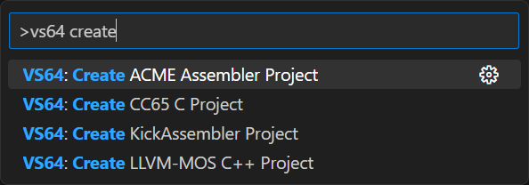
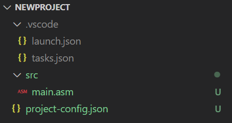

# Project and Build System 

VS64 allows you to create a new project within seconds. Just open the *Command Palette* and select one of the commands [Create ACME Assembler Project](command:vs64.createProjectAcme) or [Create Kick Assembler Project](command:vs64.createProjectKick) or [Create LLVM-MOS C++ Project](command:vs64.createProjectLlvm) or [Create CC65 C Project](command:vs64.createProjectCc65) or [Create Oscar64 C Project](command:vs64.createProjectOscar64) or [Create C64 Basic Project](command:vs64.createProjectBasic).

  

The workspace is now ready to start writing code. In case auto-build is activated, you should see the build system getting active. Also, after successful compilation, you can immediately use the debugger as a `.vscode` folder with default launch configurations have also been created for you. A default build task has been defined so that you can rebuild your project any time.

  

> **Please Notice:** The project initialization commands do not overwrite existing files. Therefore, you have to
delete any existing conflicting folder content before.
