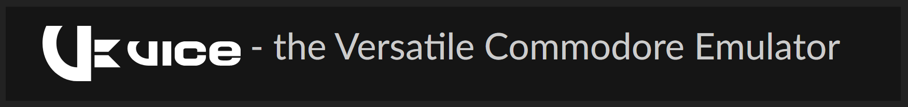
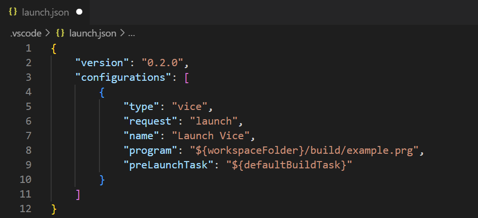

  

# Emulator Debugging Support 

The VICE emulator is integrated to the debugging system of VS64.

- Debug launch configuration
- Remote monitoring (binary monitor interface)
- Breakpoints support
- Register and memory view
- Recommended version is 3.7 or above

  

